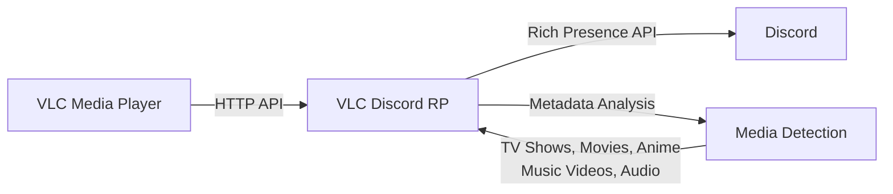

# VLC Discord Rich Presence

> Show your friends what you're watching or listening to in VLC directly on Discord.

## How It Works

1. **VLC Integration**: Connects to VLC's HTTP interface (automatically enabled)
2. **Media Analysis**: Extracts metadata and analyzes filenames to detect content type
3. **Smart Detection**: Identifies TV shows, movies, anime, music videos, documentaries, and general audio/video
4. **Discord Integration**: Updates your Discord status with rich media information and artwork

## Features

- **Smart Detection**: Automatically detects TV shows, movies, anime, music videos, documentaries, and general audio/video content
- **Rich Presence**: Shows detailed media information with artwork and metadata
- **Filename Analysis**: Advanced parsing of media filenames for accurate content identification
- **Tray Controls**: Enable/disable from system tray with temporary disable options
- **Auto-Updates**: Built-in update system for the latest features
- **Windows Optimized**: Fast and lightweight, designed specifically for Windows

## Installation

### Option 1: Setup Installer (Recommended)

1. Download `vlc-rpc-x.x.x-setup.exe` from [Releases](https://github.com/valentin-marquez/vlc-rpc/releases)
2. Run the installer
3. Launch VLC Discord RP
4. The app will configure VLC automatically

### Option 2: Portable Version

1. Download `vlc-rpc-x.x.x-portable.exe` from [Releases](https://github.com/valentin-marquez/vlc-rpc/releases)
2. Run the executable (no installation required)
3. Configure VLC when prompted

## Quick Start

1. **Install & Launch**: Run VLC Discord RP
2. **Auto-Setup**: The app will configure VLC's HTTP interface automatically
3. **Play Media**: Start playing something in VLC
4. **Check Discord**: Your status should appear within seconds

## Requirements

- **Windows 10/11** (64-bit)
- **VLC Media Player** (any recent version)
- **Discord** desktop app

## Screenshots

| Music Detection                      | Video Detection                      | Paused State                           |
| ------------------------------------ | ------------------------------------ | -------------------------------------- |
|  |  |  |

## Configuration

The app runs in your system tray. Right-click the tray icon to:

- Enable/disable Discord Rich Presence
- Temporarily disable for 15 minutes, 1 hour, or 2 hours
- Access settings and configuration

## Troubleshooting

**Discord not showing status?**

- Make sure Discord desktop app is running
- Check that "Display current activity as a status message" is enabled in Discord Settings > Activity Privacy

**VLC not detected?**

- The app will prompt you to configure VLC if needed
- Ensure VLC's HTTP interface is enabled (the app handles this automatically)

## License

This project is licensed under the AGPLv3 License - see the [LICENSE-CODE](LICENSE-CODE) file for details.

## Contributing

Contributions are welcome! To contribute:

1. Fork the repository
2. Create a feature branch (`git checkout -b feature/amazing-feature`)
3. Make your changes
4. Add a changeset: `bun changeset` (see [.changeset/CONTRIBUTING.md](.changeset/CONTRIBUTING.md))
5. Commit your changes (`git commit -m 'Add amazing feature'`)
6. Push to the branch (`git push origin feature/amazing-feature`)
7. Open a Pull Request

Please ensure your PR includes a changeset for any user-facing changes.

## Support

Found a bug or have a feature request? [Open an issue](https://github.com/valentin-marquez/vlc-rpc/issues) on GitHub.

If you enjoy this project and want to support its development:

---

Made with ❤️ for the VLC and Discord communities

