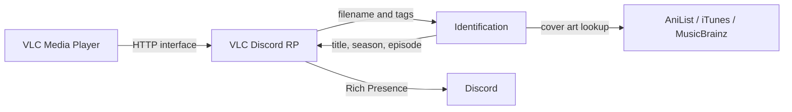

# VLC Discord RP

[](https://github.com/valentin-marquez/vlc-rpc/releases)
[](https://github.com/valentin-marquez/vlc-rpc/releases)
[](https://github.com/valentin-marquez/vlc-rpc/releases)
[](LICENSE-CODE)

Shows what you are playing in VLC on your Discord profile, with the cover art when it can find one.

VLC already exposes everything it knows over a local HTTP interface. This app reads that, works out
what the file actually is, looks for artwork, and hands the result to Discord. The interesting part
is the middle step, because a file on disk is usually called something like
`[SubsPlease] Frieren - 11 (1080p) [A1B2C3D4].mkv`, and nobody wants that on their profile.

| Music | Anime | Paused |
| --- | --- | --- |
|  |  |  |

## How it works


```mermaid
graph LR
    A[VLC Media Player] -->|HTTP interface| B[VLC Discord RP]
    B -->|filename and tags| D[Identification]
    D -->|title, season, episode| B
    D -->|cover art lookup| E[AniList / iTunes / MusicBrainz]
    B -->|Rich Presence| C[Discord]
```

The app polls VLC's status endpoint roughly every 1.5 seconds. When something is playing it reads
the file's tags and parses its name, then decides whether it is looking at a series, a film, or a
track. From there it tries to find a cover, and sends Discord a presence built from what it found.

It only sends an update when something meaningful changed. Playback position alone does not count,
because Discord animates the progress bar on its own from the start and end timestamps.

## Where the artwork comes from

The app tries sources in order and stops at the first confident match. It would rather show no
cover than the wrong one, so a weak match is discarded.

| Content | Source | Needs an account |
| --- | --- | --- |
| Audio with cover art in the file | The file itself | No |
| Audio with usable tags | iTunes Search, then MusicBrainz and the Cover Art Archive | No |
| Audio with no usable tags | The sound itself, see below | No |
| Anime | AniList | No |
| Films and western television | Nothing automatic, see Limitations | No |

A file ripped from YouTube usually has no artist and a title that is really its
filename, so no text search can find it. For those the app computes an acoustic
fingerprint of the audio and asks AcoustID which recording it is, which does not
care what the file is called. That step runs last, only for what nothing else
could identify, and you do not need an account for it.

Artwork embedded in an audio file cannot be handed to Discord directly, because Discord fetches
images by URL and knows nothing about your disk. The app uploads that image to a temporary public
file host so Discord can reach it. Read the Limitations section before you decide how you feel
about that.

## Requirements

- Windows 10 or 11, 64 bit. These are the only builds published.
- VLC Media Player, with its HTTP interface, which the app turns on for you.
- The Discord desktop app, running. Rich Presence does not work through Discord in a browser.
- In Discord, under Settings, Activity Privacy, "Display current activity as a status message"
  must be on.

An internet connection is only needed for cover art lookups and for updates. Everything else is
local.

## Installing

Take a build from [Releases](https://github.com/valentin-marquez/vlc-rpc/releases).

`vlc-rpc-x.x.x-setup.exe` installs normally and can start with Windows.
`vlc-rpc-x.x.x-portable.exe` runs from wherever you put it, and still keeps its configuration in
your user profile.

## First run

VLC's HTTP interface is off by default, so the app walks you through turning it on. It writes the
port and a password into VLC's own configuration file, `vlcrc`.

**VLC reads that file when it starts, so you have to restart VLC once after the setup.** The app
cannot do that part for you.

The default port is 9080. If something else on your machine is already using it, change it in
Settings and restart VLC again. The password is generated if you leave it empty, and it is only
ever used to talk to VLC on your own machine.

## Using it

The app lives in the system tray, and closing the window does not quit it. Right click the tray
icon to turn Rich Presence off, or to turn it off for 15 minutes, an hour, or two hours, which is
what you want when you are watching something you would rather not broadcast.

**Layout** is where you pick how a track is laid out on your profile: title first, album first, or
artist first. Each preset shows a live preview of what Discord will render.

**Corrections** are for when the app gets it wrong, or when there is no source to get it right
from. On the main screen, the last row of "What VLC reports" opens a small form already filled in
with what the app worked out. For video you can change the title, the cover, and whether it is a
film or a series. For audio only the cover, because the text is built from the file's own tags
rather than from a lookup.

A correction always wins. It is not weighed against anything, it skips the lookup entirely, and
for audio it also beats the artwork embedded in the file. That last part matters more than it
sounds, because a wrong or low resolution cover baked into an MP3 is the most common reason to
want a correction in the first place.

Saved corrections are listed in Settings, where you can see what each one applies to and remove it.

## Limitations

These are real, and worth knowing before you file a bug.

**There is no automatic cover for films or western television.** Not because it is unfinished, but
because there is no source for it that works without credentials. Film posters are studio property,
and every catalogue that carries them puts an API key in front, usually behind an application form.
Anime works because AniList is open. Music works because iTunes and MusicBrainz are open. For
everything else, corrections are the answer, and they exist for exactly this reason.

**Embedded cover art is uploaded to a public file host.** To show the artwork inside your audio
files, the app uploads that image to one of several temporary hosts (catbox.moe, uguu.se, 0x0.st,
tempfile.org) and gives Discord the resulting link. Anyone holding that link can open the image
for as long as it lives, and the app asks for roughly seven days. Only the image goes up, under a
generated name like `cover_1757980800000.jpg`, so neither your filename nor its path travels with
it. If you would rather not, leave Rich Presence off for those files, or clear the cover with a
correction.

**A correction is tied to how the file is named.** The app identifies media from the filename, so
the same series under two different release names counts as two different things, and a correction
saved for one will not apply to the other. Settings shows what each correction applies to, so you
can see why one stopped working instead of guessing.

**VLC has to be restarted after the initial setup,** and again after any change to the port or the
password, because VLC only reads `vlcrc` at startup.

**Identification is confidence based and prefers silence.** If nothing scores well enough you get
the filename and no cover, rather than a confident guess at the wrong show.

**Windows only, as published.** The core has no Windows specific logic, but no macOS or Linux
builds are produced or tested.

## Technical notes

Electron with TypeScript throughout, React in the renderer, built with electron-vite, linted and
formatted with Biome, tested with Vitest. The package manager is bun.

The main process is organised by feature rather than by layer. Each folder under
`src/main/features/` owns its own types, handlers and services, and `src/main/main.ts` is a
composition root that builds the object graph by hand. There is no dependency injection framework
and there are no singletons: everything arrives through a constructor, which is what lets the test
suite run with no VLC, no Discord and no network.

```
src/main/       main.ts, core/ (logger, config, ipc, clock), features/<name>/
src/preload/    the only bridge between main and renderer
src/renderer/   React, also organised by feature
src/shared/     the contract between main and renderer, and nothing else
```

`src/shared/ipc/channels.ts` is the single source of truth for every IPC channel. Adding one there
makes the compiler demand both the handler in main and the bridge in preload, so the two halves
cannot drift apart quietly.

Identification lives in `features/catalog` for video and `features/music` for audio. Both follow
the same shape: parse, build a cache key, ask the providers, score the candidates, and return a
result only above a threshold. Scoring uses Sorensen-Dice bigram similarity over normalised titles.
Results are cached to disk, so replaying the same album does not repeat the lookups.

Running it locally:

```bash
bun install
bun run dev        # electron-vite in watch mode
bun run test       # vitest, needs no VLC and no network
bun run typecheck  # main and renderer
bun run lint       # biome, writes fixes
bun run build      # typecheck, then bundle
```

Audio fingerprinting needs two things a clone does not have. `bun install` fetches
Chromaprint's `fpcalc` for your platform into `resources/bin/`, which is git ignored, and the
AcoustID client key is read at build time from `MAIN_VITE_ACOUSTID_KEY`. Copy `.env.example` to
`.env` and put your own key there if you want that step to run; see
[acoustid.org/new-application](https://acoustid.org/new-application). Without a key the app skips
it and everything else behaves exactly as it does in a release.

[CONTRIBUTING.md](CONTRIBUTING.md) documents the conventions the codebase actually follows,
including file naming, the barrel rules, and the logging rules that keep your VLC password out of
the log file. Read it before writing code.

## Troubleshooting

**Nothing appears on Discord.** Check that the Discord desktop app is open, and that "Display
current activity as a status message" is on under Settings, Activity Privacy. Discord also hides
your own activity in some views, so it is worth asking someone else before concluding it is broken.

**The app says it cannot reach VLC.** Restart VLC. This is almost always the first run case, where
the settings were written but VLC has not read them yet. If it persists, check that the port in
Settings matches the one in `vlcrc`, and that nothing else is using it.

**A show is identified as the wrong one.** Use a correction. If it happens with a common release
naming pattern, an issue with the exact filename is genuinely useful.

**The cover disappeared after a while.** Uploaded artwork lives on a temporary host and expires.
Playing the file again uploads it again.

## Contributing

Fork, branch, and open a pull request. Add a changeset for anything a user would notice:

```bash
bun changeset
```

See [.changeset/CONTRIBUTING.md](.changeset/CONTRIBUTING.md) for what goes in one, and
[CONTRIBUTING.md](CONTRIBUTING.md) for the code conventions.

## License

AGPL-3.0. See [LICENSE-CODE](LICENSE-CODE).

## Support

Bugs and feature requests go to [Issues](https://github.com/valentin-marquez/vlc-rpc/issues). For
an identification bug, include the exact filename, since that is what the app reads.

If you want to support the project:

[](https://ko-fi.com/nozzdev)
