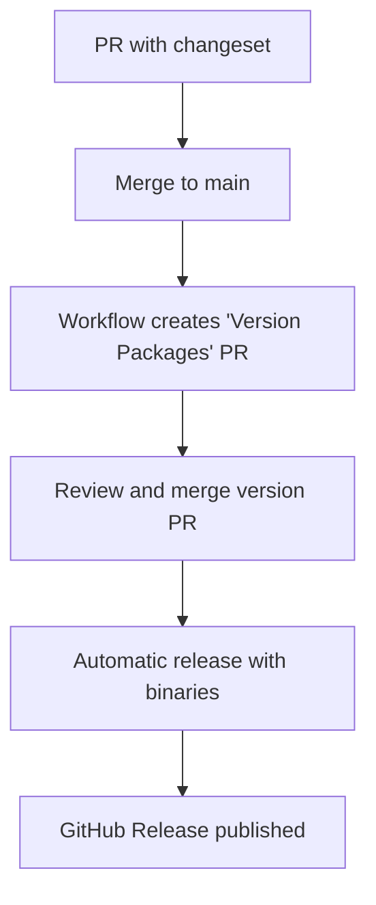

# Changesets Workflow

This project uses [Changesets](https://github.com/changesets/changesets) to manage versions and generate changelogs automatically.

## 🚀 What are Changesets?

Changesets is a tool that helps to:

- Manage versions automatically and semantically
- Generate detailed changelogs
- Coordinate releases between multiple contributors
- Integrate with GitHub to create automatic releases

## 📝 Workflow for Contributors

### 1. After making changes

When you've finished implementing a feature, fix, or breaking change:

```bash
bun run changeset
```

This command will ask you:

1. **Type of change**: `patch`, `minor`, or `major` (following [SemVer](https://semver.org/))
2. **Summary**: A clear description of the change

### 2. Types of changes

- **🐛 Patch** (`0.0.X`): Bug fixes, small improvements that don't break compatibility
- **✨ Minor** (`0.X.0`): New features that don't break compatibility
- **💥 Major** (`X.0.0`): Breaking changes that break compatibility

### 3. Complete workflow example

```bash
# 1. Make your changes
git add .
git commit -m "feat: add RPC control shortcuts in tray menu"

# 2. Create changeset
bun run changeset
# Select 'minor' for new feature
# Write: "Add Discord RPC control shortcuts in system tray menu"

# 3. Commit the changeset
git add .changeset/
git commit -m "docs: add changeset for RPC tray controls"

# 4. Push and create PR
git push origin feature/rpc-tray-controls
```

## 🤖 Automation with GitHub Actions

The project has three configured workflows that work automatically with Changesets:

### 1. **CI/CD Workflow** (`.github/workflows/build.yml`)

- Runs on every PR and push to `main`
- Verifies lint, typing, and multiplatform builds
- **Verifies that a changeset exists** in PRs (with friendly warning if missing)

### 2. **Release Workflow** (`.github/workflows/release.yml`)

- Runs when merged to `main`
- **If there are pending changesets**: Creates a "Version Packages" PR with updated versions
- **If that PR is merged**: Builds and publishes release automatically with binaries

### 3. **Changeset Bot** (`.github/workflows/changeset-bot.yml`)

- Automatically comments on PRs about changeset status
- Provides useful guides on when to create changesets
- Updates comments dynamically

### Complete automated flow:



## 🔧 Available scripts

```bash
# Create a new changeset
bun run changeset

# View status of pending changesets
bun run changeset:status

# Apply changesets and update versions (maintainers only)
bun run changeset:version

# Publish release (maintainers only)
bun run changeset:publish
```

## 📋 Best practices

### Writing good changesets

**✅ Good:**

```markdown
Add Discord RPC control shortcuts in system tray menu

- Add quick RPC toggle for permanent enable/disable
- Add temporary disable options (15min, 1h, 2h)
- Add timer persistence setting in Settings page
```

**❌ Bad:**

```markdown
Fixed stuff
```

### When to create changesets

- **DO create** for: new features, bug fixes, breaking changes
- **DON'T create** for: documentation changes, internal refactoring without API changes, CI/CD changes

### The bot helps you

Don't worry if you forget to create a changeset - our bot will automatically comment on your PR with useful instructions:

- ⚠️ **Without changeset**: Reminds you when you need one
- ✅ **With changeset**: Confirms everything is fine and explains what happens next

## 🎯 For Maintainers

### Managing releases

1. **Normal pushes to main**: The workflow creates "Version Packages" PRs automatically
2. **Merge version PR**: Publishes release automatically
3. **Emergency releases**: Use `bun run changeset:publish` manually

### GitHub configuration

The workflows require these permissions in GitHub Actions:

- `contents: write` - To create releases and modify files
- `pull-requests: write` - To create version PRs
- `issues: write` - To comment on PRs

## 📚 Additional resources

- [Changesets Documentation](https://github.com/changesets/changesets)
- [Semantic Versioning](https://semver.org/)
- [Conventional Commits](https://www.conventionalcommits.org/)

